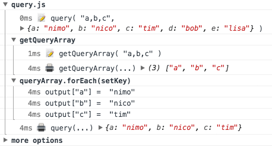

# 文档


````code
{
    title: '$show()',
    desc: '所有 `log` 在 `最后一个 groupEnd()`调用时才会输出，这样能让日志更加易于阅读。甚至可以延迟到所有代码执行结束再输出。',
    html: '',
    js: './basic.demo.js',
    source: './basic.demo.js',
    open: true,
    horiz: true
}
````
